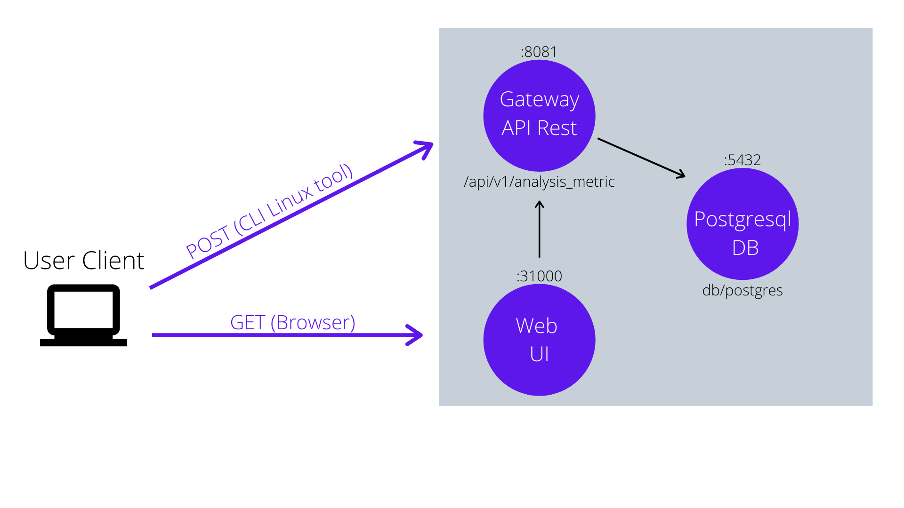
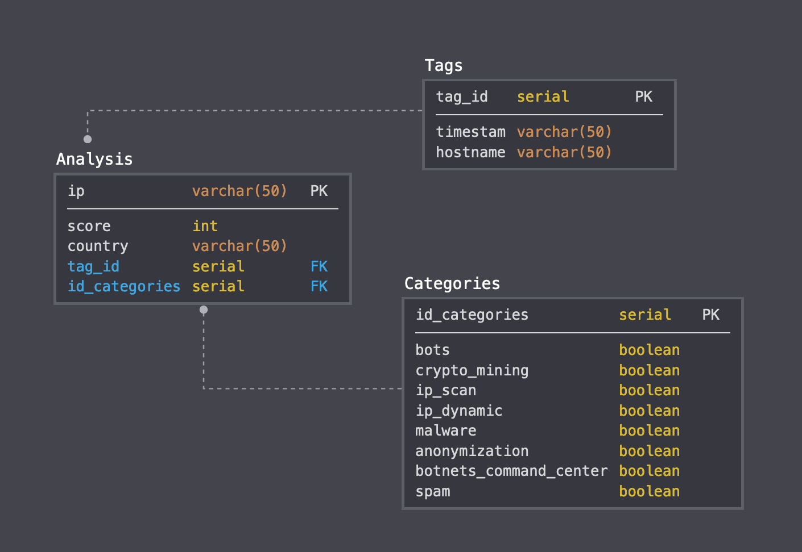
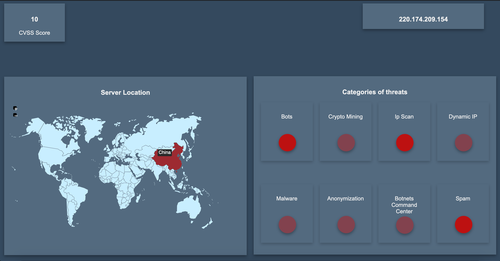

# Cloud for ipscan Linux Tool based Microservices on Kubernetes

This proyect have 2 parts:
1) **CLI linux ipscan command:** C-based linux tool. Uses IBM X-force Exchange API for IP analyze. And send data to this Cloud.
2) **Cloud for ipscan Linux Tool based Microservices on Kubernetes:** A Microservices-based Cloud on Kubernetes.  


## About Cloud
The Cloud contains 3 parts:
* **API:** Python-based API Rest
* **DB:** Postgresql database
* **GUI:** HTML/CSS/JS
 

Each part run in a independently container.

### Cloud Architecture 
Each purple circle in diagram is a separatly container
<kbd></kbd>

### API
#### **POST**
The POST URL is: `/api/v1/analysis_metric`

Expect a schema like:
```
{
  "ip": "string",
  "score": 0,
  "country": "string",
  "tags": {
    "host_name": "string",
    "time": "string"
  },
  "categories": {
    "bots": false,
    "crypto_mining": false,
    "ip_scan": false,
    "ip_dynamic": false,
    "malware": false,
    "anonymization": false,
    "command_center_botnets": false,
    "spam": false
  }
}
```

Call the function  `submit_ip_analysis_metric()` that storage data on Postgresql database

#### **GET**
The GET URL is: `/api/v1/analysis_metric/last`

Do not expect a schema.

Call the function  `get_ip_analysis_metric()` that request the last IP stored in the database and its respective information


#### **Response codes**
CODE | Description 
--- | --- 
200 | Successful Response
422 | Validation Error
500 | Internal Server Error

### DB
Uses [Dockerhub Postgresql image](https://hub.docker.com/_/postgres)

In dockerfile you should see `COPY script.sql /docker-entrypoint-initdb.d/` this line copy script.sql (Create database) on the new container.

Database diagram:
<kbd></kbd>


### GUI
The GUI do a GET to our API at http://localhost:8081/api/v1/analysis_metric/last each second. Expects a JSON that contains the last ip storage in a data base

The GUI shows 4 principles elements
* IP analized
* CVSS Score
* Map with server location
* Categories of threats
    * **Bots:** Botnet member activity
    * **Cryto Mining:** Used for cryptocurrency mining
    * **Ip Scan:** Illegally scan networks looking for vulnerabilities
    * **Dynamic IP:** Includes ip addresses of dial-up servers and DSL lines
    * **Malware:** Includes IPs from malicious sites or websites with malware
    * **Anonymization:** Includes the IP addresses of the Web proxies that can be used for anonymous browsing
    * **Botnets command center:** Includes IP addresses, botnet hosting command and server control
    * **Spam:** Includes the IP addresses that send spam

How's the GUI looks like:
<kbd></kbd>

### Cloud resilience and redundancy (High Availability)
For make sure that our application will have High Availability, I implemented:
* Redundancy (2 replicas of each pod)
* Load Balancer: For load distribution
* Deployments: With that we have resilience. If some pod died, kubernetes will create a new

The kubertenes configuration file is `kube-deployment.yml` 
This file have 4 parts: 
1) **db:** Is for database. Contains: 
    * Deployment: Uses postgresql-database:10.0 docker image
    * Service: Expose port 5432
2) **api-rest:** Is the API Rest gateway. Contains: 
    * Deployment: Uses api-gateway:v1 docker image
    * Service: Expose port 7676
3) **ui-api:** Is for GUI API. You can find it in /api/docs Contains: 
    * Deployment: Uses api-gateway:v1 docker image
    * Service: Take the 80 port and expose 8081. Is a Load Balancer.
4) **web-ui:** Is the oficial UI. Contains: 
    * Deployment: Uses html:v1 docker images
    * Service: Expose port 31000


## Prerequisites
* [docker](https://docs.docker.com/install/)
* [git](https://git-scm.com/book/en/v2/Getting-Started-Installing-Git)
* [kubectl](https://kubernetes.io/docs/tasks/tools/install-kubectl/)
* [minikube](https://kubernetes.io/es/docs/tasks/tools/install-minikube/)


## Usage
For setup you only need follow 2 steps:

### 1. Clone repo
```
$ git clone https://github.com/Bernal-R/Cloud-For-ipscan-linux-tool.git
$ cd Cloud-for-ipscan-linux-tool
```

### 2. Create a deployment
I already create automated script for the deployment, so you only need run:
```
$ sh deploy.sh
```

Now you can find two services exposed:
1) **API GUI:** You cand find it in your browser: http://localhost:8081/api/docs/
    * You would see the API Rest interface and you can interact with it.
2) **GUI:** You can find it in your browrser: http://localhost:31000/
    * Updates real time each new ip storage in db


#### What's on deploy.sh file
The deployment file have 2 parts: 

1) Compile the docker images for each service:

* Build API docker image
```
$ cd api/
$ sh build-api.sh
$ cd ../
```
* Build Postgresql docker image
```
$ cd db/
$ sh build-db.sh
$ cd ../
```
* Build Web UI docker image
```
$ cd html/
$ sh build-ui.sh
$ cd ../
```

2) Execute .yml file on kubernetes 
```
$ kubectl apply -f kube-deployment.yml
```

#### Check all is working good
```
$ kubectl get all
```
The output should be similar to:
```
NAME                           READY   STATUS    RESTARTS   AGE
pod/api-rest-c65bc7548-f7snk   1/1     Running   0          35m
pod/api-rest-c65bc7548-pdf7c   1/1     Running   0          35m
pod/db-5b87c9dc68-5rspx        1/1     Running   0          35m
pod/db-5b87c9dc68-tqlhw        1/1     Running   0          35m
pod/ui-api-6d8f88f4c7-6d696    1/1     Running   0          35m
pod/ui-api-6d8f88f4c7-kdkp6    1/1     Running   0          35m
pod/ui-web-7684fff854-6l8ng    1/1     Running   0          35m
pod/ui-web-7684fff854-crc7b    1/1     Running   0          35m


NAME                 TYPE           CLUSTER-IP       EXTERNAL-IP   PORT(S)          AGE
service/api-rest     ClusterIP      None             <none>        7676/TCP         35m
service/db           ClusterIP      None             <none>        5432/TCP         35m
service/kubernetes   ClusterIP      10.96.0.1        <none>        443/TCP          64m
service/ui-api       LoadBalancer   10.110.155.155   localhost     8081:31465/TCP   35m
service/web-ui-svc   NodePort       10.110.181.210   <none>        80:31000/TCP     35m


NAME                       READY   UP-TO-DATE   AVAILABLE   AGE
deployment.apps/api-rest   2/2     2            2           35m
deployment.apps/db         2/2     2            2           35m
deployment.apps/ui-api     2/2     2            2           35m
deployment.apps/ui-web     2/2     2            2           35m

NAME                                 DESIRED   CURRENT   READY   AGE
replicaset.apps/api-rest-c65bc7548   2         2         2       35m
replicaset.apps/db-5b87c9dc68        2         2         2       35m
replicaset.apps/ui-api-6d8f88f4c7    2         2         2       35m
replicaset.apps/ui-web-7684fff854    2         2         2       35m
```
